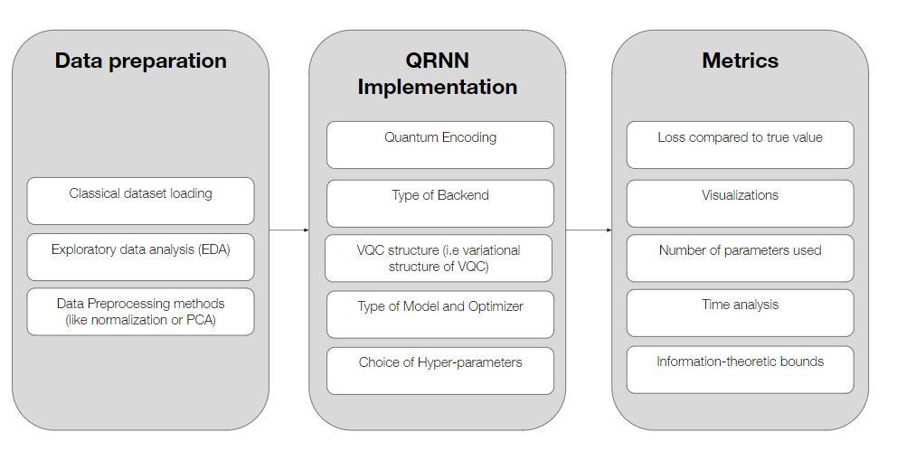

# Quantum RNNs

This research track is about our investigation on Quantum Recurrent Neural Networks (QRNN), improving on well-known classical machine learning techniques like Long Short Term Memory (LSTM) or Gated Recurrent Units (GRU) using the power of Quantum Neural Networks (QNN) to create quantum counterparts QLSTM and QGRU.

We have done a couple of use cases for it so far:

QLSTM for asset price prediction: https://github.com/DikshantDulal/SoftServe_QLSTM
QGRU for quantum drug generator: https://gitlab.com/damyr_hadiiev/quantum-drug-generator/-/tree/main/ReLeaSE-multiobjective
We have found a couple of academic papers that would be useful:

The power of quantum neural networks by Abbas et al. https://arxiv.org/pdf/2011.00027.pdf
Effective dimension of machine learning models by Abbas et al. https://arxiv.org/pdf/2112.04807.pdf

On Generalization Bounds of a Family of Recurrent Neural Networks: http://proceedings.mlr.press/v108/chen20d/chen20d.pdf
Vapnik-Chervonenkis Dimension of Recurrent Neural Networks: https://static.aminer.org/pdf/PDF/000/192/620/vapnik_chervonenkis_dimension_of_recurrent_neural_networks.pdf
Spectrally-normalized margin bounds for neural networks: https://proceedings.neurips.cc/paper/2017/file/b22b257ad0519d4500539da3c8bcf4dd-Paper.pdf

We are consolidating the effort into the following GitHub: https://github.com/JonasTYW/Quantum-RNNs

# Workflow and To-do

Here we discuss the plan for the paper for QRNNs. Below shows the general workflow for QRNNs:

We split it up into three sections: the preparation of data; the implementation of the QRNN (or RNN) itself; and the metrics for the model.

## Data preparation

Being a machine learning technique, data preparation is still extremely important for QRNNs despite being classical. In fact, to a certain extent, due the limitations of QML models (and by extension, QRNN models), careful preparation of data becomes a whole lot more important. This directly affects the quality of the model that would be created, so we need to approach this carefully.

### Classical dataset loading

The first question one might ask is why we are only considering classical datasets. The simple answer to the question is that for the foreseeable future, most of the use cases that we would be interested in comes in the form of classical data. Beyond that, quantum datasets are also notoriously difficult to understand from an epistemological point-of-view, and the simplest (and by simplest I mean most obvious) use of quantum data would likely only come after a QRAM device has been made, that is to say beyond NISQ-era. Thus, we focus our current efforts on classical data.

This stage of data preparation is more of considering the architecture of the code, and how we want to load the dataset to be trained in the quantum model. There are a few preset functions that already do this: the Dataloader in the Pytorch library, Keras also has it's dataloader function. However, during the course of the two use cases we explored above, we found out that we had to do extra preparation for loading. For asset price prediction, we did some extra preparation to put it into the Dataloader class from Pytorch, whereas for the quantum drug generator we instead used the dataloader function from the ReLeaSE algorithm. This section is thus architectural in nature, where we consider how we want to load the data, and whether there's a good way to unify the architecture to make it easier for QRNNs in general.

### Exploratory Data Analysis

This section is fairly self-explanatory, and also not much different from classical machine learning. Basic things we need to check are correlation between variables, checking for outliers, and removing any suspicious looking data. Visualizations of data provided would also be good. The main point of this is to clean the data to make sure that it is ripe for machine learning. A good model cannot save bad data. Beyond that, the EDA would also help to inform our data preprocessing methods below.

### Data Preprocessing methods

Methods that we are thinking about:

- Normalization: Make sure that variables are normalized so that all variables are of similar scale.
- PCA: Linear Dimension reduction technique that maximizes variance. Applicable to most datasets.
- LDA: Linear Dimension reduction technique that maximizes difference between classes. Applicable to only classification problems.
- NLDR: Non-linear Dimension reduction techniques. If we need to go there, I will look into it more, but methods like kernal PCA or different type of mappings can be used.

## QRNN Implementation

### Quantum Encoding

The main consideration here is how to encode the classical data (that we have already pre-processed) into quantum data. One of the key considerations that we have here is what type of encoding do we want?

Normally, we use a neural network layer to preprocess the classical data into the shape we want, and input processed data into a feature map, where we have to consider:
- Number of rotations
- Type of rotations
- Whether we should have entangled feature maps

Beyond that, we should also look at the types of encoding around, if it fits our purposes:

Type of Encoding:
- Basis Encoding: For classification (I think)
- Amplitude Encoding: Normally what we use
- Phase Encoding
- Other encoding schemes

### Type of Backend

The type of backend that we consider is important. One of the key features of QML is that it is theoretically supposed to be resistant to noise, which makes it useful for the NISQ-era. However, being resistant does not mean immune, and quantum backends take notoriously long to run. Thus, for the sakes of the experiments, we have to consider do we want:
- Classical simulator
- Quantum backend

It is obvious at some point that we have to try both, but it is likely that we will start with the classical simulator. With that, since we are using Pennylane, we have a few options:
- default.qubit: not recommended
- lightning.qubit: Best CPU one, good for low number of qubits
- GPU options, to be used on DGX-2

Note that best refers to time-scale. The results should not differ to much since they are purely classical.

Other than that, we also have to consider:
- Number of qubits used
- Number of shots (to add in statistical noise)
- Noise mapping (to simulate quantum computer noise)

For quantum computers, we are likely to use super-conducting qubits, either from IBM or AWS. For cleaner qubits, we should also take a look at ion-trap QCs. Perhaps we should maybe explore whether it is possible to use QA somehow? For D-wave, but unlikely.

### VQC structure 

Basically, we also need to discuss how the circuit structure (that would need to be trained) would look like. A few considerations we need to have:
- Entangling layer: How do we want the qubits to talk to each other? While it is possible for simulators to entangle however we want, for actual quantum computers, we have to think about the entangling layer a bit more closely
- Rotations: How many rotations? 1 rotation (in a certain direction?), or multiple? Theoretically speaking 2 should be enough, but experimentally, 3 might be better
- Number of layers: How many times to repeat the structure?

Perhaps we should also ask Khrystyna to explain her work again.

### Type of Model and Optimizer

Structure of Neural Network Model

One of the more important considerations would be the 

Type of RNN:
- GRU
- LSTM
- QGRU
- QLSTM

Preprocessing Layer:
- How many layers
- Structure of layer

Postprocessing Layer:
- How many layers
- Structure of layer

Optimizers:
- Adam
- Adadelta
- etc

### Hyper-parameter Search

Likely have to perform a grid-search for LR

## Metrics

As important as the implementation itself (and arguably the most important), we need to have metrics to guide us to see whether quantum implementations are better than the classical counterparts.

### Loss

Based on the type of problem, we have to consider different types of loss functions. Most of the time, preset loss functions are sufficient for our purposes, such as:
- MSELoss
- MAELoss
- BCELoss
- Cross Entropy Loss

These loss functions are not only an integral part of training, but they also present to us how well the model is doing. On the other hand, sometimes these loss functions are insufficient, and while we use them to train, another function has to be used to show us what the model is trying to aim for (most of the time, those functions cannot be used for training though). An example would be the percentage of valid SMILES in the QGRU project. 

### Visualizations 

There are a number of key visualizations that we have to have:
- Plotting graphs of loss (or some other function) over epochs
- Graphs or tables of predictions vs true values
- Time analysis graphs if possible

### Number of parameters used

Self-explanatory. We compare the number of parameters used between different models. Normally the lesser the number of parameters, the better (less computer memory used). 

### Time analysis

Self-explanatory. We compare models to see which runs faster. Can go by total time, or time per epoch etc.

### Information-theoretic bounds

The power of quantum neural networks by Abbas et al. https://arxiv.org/pdf/2011.00027.pdf
Effective dimension of machine learning models by Abbas et al. https://arxiv.org/pdf/2112.04807.pdf
Information-theoretic bounds on quantum advantage in machine learning by Huang et al.:https://arxiv.org/pdf/2101.02464.pdf

## Testing for the paper

### Experimental

Of the metrics above, the first 4 have to do with the experimental tests.

Experiments:
- Asset price prediction

### Theoretical

The theoretical tests for advantage would be then lay on the information-theoretic bounds.

